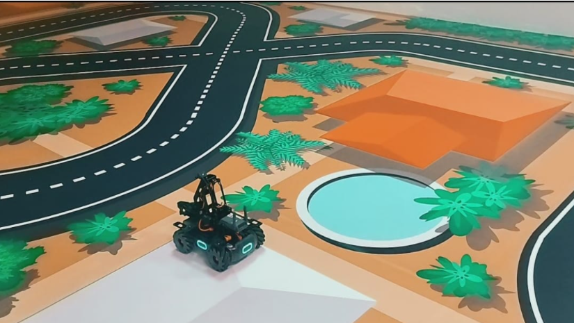

# MobileRobot-Openloopcontrol
## Aim:

To develop a python control code to move the mobilerobot along the predefined path.

## Equipments Required:
1. RoboMaster EP core
2. Python 3.7

## Procedure

### Step1: Import robot from robomaster start the project.
### Step2: Import time.
### Step3: Adjust the x, y and z axis to adjust the movement of the robot.
### Step4: Adjust the movement of the robot to move in circles.
### Step5: Close to finish the progaram.

## Program
```
from robomaster import robot
import time

if __name__ == '__main__':
    ep_robot = robot.Robot()
    ep_robot.initialize(conn_type="ap")

    ep_chassis = ep_robot.chassis

    ## Write your code here
    '''
    x=x-axis movement distance,(meters) [-5,5]
    y=y-axis movement distance, (meters) [-5,5]
    xy speed = xy axis movement speed,(unit meter/seconds) [0,5,2]
    '''
    ep_chassis.move(x=3,y=0,z=0,xy_speed=0.75).wait_for_completed()
    ep_chassis.move(x=0,y=0,z=45,xy_speed=0.25).wait_for_completed()
    ep_chassis.move(x=0,y=0.25,z=0,xy_speed=0.75).wait_for_completed()
    ep_chassis.move(x=3,y=0,z=0,xy_speed=0.75).wait_for_completed()

    ep_chassis.drive_speed(x=0.4,y=0,z=-20)
    time.sleep(12) 
    ep_chassis.move(x=2,y=0,z=0,xy_speed=0.75).wait_for_completed() 
    ep_chassis.drive_speed(x=0.4,y=0,z=-20)
    time.sleep(10) 
    ep_chassis.move(x=2,y=0,z=0,xy_speed=0.75).wait_for_completed() 
    
    ep_robot.close()
```

## MobileRobot Movement Image:



## MobileRobot Movement Video:
[](https://youtu.be/FIiXZyqvniA)

## Result:
Thus the python program code is developed to move the mobilerobot in the predefined path.


```
Mobile Robotics Laboratory
Department of Artificial Intelligence and Data Science/ Machine Learning
Saveetha Engineering College
```
